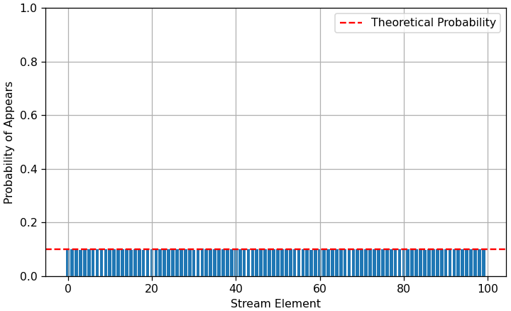

# 🌊 Reservoir Sampling Algorithm

This project implements the **Reservoir Sampling**. This fundamental technique is especially usefule when we have to deal with streaming data whose total length may be unknown or too large to fit into memory. These disadavantages are mainly known from production, 
where data is collected continuously.

---

## 💡 Concept and Goal

In the context of Big Data and stream-based Machine Learning, standard sampling methods sucha as **Simple Random Sampling**, **Stratified Sampling** or **Weighted Sampling** where the data is collected only from past data can lead to **temporal bias** 
because the collected data may quickly becomes outdated. Another reason to consider **Reservoir Sampling** is that some methods, such as SRS (Simple Random Sampling) can lead to unbalanced or unrepresentative data.

Reservoir Sampling solves this by guaranteeing that after processing the elements, **every historical item** in the stream has an **identical probability** of being included in the final reservoir. 

Imagine you’re receiving a continuous stream of temperature readings from one weather station placed in a remote area.
You want to sample a certain number, k, of weather temperatures to do analysis or train a model on.
Since the station sends data at irregular intervals and you don’t know how many readings will arrive, you can’t pre-assign a probability to each reading in advance.

Yet you’d like to guarantee that:
- Every weather temperature has an equal probability of being selected.
- You can stop the algorithm at any time and the weather temperatures are sampled with the correct probability.

## 🛠️ Steps of the Alogirthm
As the name suggests the algorithm is based on **reservoir**, which can be an array, and consists of these steps:
1. Put the first ***k*** elements int to the reservoir.
2. For each incoming $i^{th}$ element, generate a random number ***j*** such that $\ 1 \le j \le i \$.
3. If $\ 1 \le j \le k\$ then replace the $j^{th}$ in the reservoir with the $i^{th}$ element. Else, do nothing.

---

## 💻 Implementation
To test the **Reservoir Sampling** algorithm, we simulated a continuous data stream that **does not load all data into memory at once**. This is achieved using a **Python Generator**.

### 1. `streaming_data_generator.py`
This file contains the generator function that produces elements one by one, simulating an external data source (like a sensor or log file).

```python
def streaming_data_generator(n_stream: int):
    """
    Generates a sequence of integers from 0 up to (n_stream - 1), 
    simulating a data stream.
    """
    for i in range(n_stream):
        yield i
```

### 2. `reservoir_sampling.py`

This file contains the core logic of the Reservoir Sampling algorithm.

```python
def reservoir_sampling(stream: Generator, k: int):
    # Define reservoir for our stored data
    reservoir = []

    # Fetching data from the simulated streaming data
    for i, x in enumerate(stream, start=1):

        # First, fill the reservoir
        if i <= k:
            reservoir.append(x)
        # Random replacement ith element with probability k/i
        else:
            j = random.randint(1, i)
            if j <= k:
                reservoir[j - 1] = x
    
    return reservoir
```

### 3. main.py

This section demonstrates how the implemented components are connected and executed, generating a sample of $k=10$ elements from a simulated stream of $N=100$ elements.

```python
from streaming_data_generator import streaming_data_generator
from reservoir_sampling import reservoir_sampling

# Define parameters
N_STREAM = 100    # Total size of the simulated stream
K_RESERVOIR = 10  # Desired size of the final sample

# Initialize the stream generator
streaming_generator = streaming_data_generator(N_STREAM)
# Run the Reservoir Sampling algorithm
reservoir = reservoir_sampling(stream=streaming_generator, k=K_RESERVOIR)
```

---

## 🧪 Statistical Verification

The core guarantee of Reservoir Sampling is that every element from the stream has an **equal probability** of being selected. To empirically verify this, we ran a large-scale simulation.

### 3.1 Step-by-Step Statistical Proof

The integrity of the algorithm relies on the **perfect statistical balance** where the probability of insertion is offset by the probability of survival for older elements. We trace this using a small example with **$K=2$** and elements $e_1$ through $e_4$.

The final target probability for any element $e_i$ is $\frac{K}{i}$.

#### Initialization Phase ($i \le 2$):

1.  **Element $e_1$ ($i=1$):** Added to the reservoir. $P(e_1 \in R) = 1$.
2.  **Element $e_2$ ($i=2$):** Added to the reservoir. $P(e_2 \in R) = 1$.

The reservoir is full and has **2 elements** ($K=2$).

#### Sampling Phase ($i > K$):

##### Step 3: Processing $e_3$ ($i=3$)
* **Draw $j$ from $\{1, 2, 3\}$**.
* **New Element ($e_3$):** The probability of $e_3$ entering is $P(\text{Entry}) = \frac{K}{i} = \frac{2}{3}$.
    * If $j \le 2$ (i.e., $j=1$ or $j=2$), $e_3$ replaces $e_j$.
* **Old Elements ($e_1, e_2$):** The probability of removal for $e_1$ and $e_2$ is $\frac{1}{i} = \frac{1}{3}$. The probability of survival is $1 - \frac{1}{3} = \frac{2}{3}$.
* **Result:** $P(e_1 \in R \text{ after } e_3) = 1 \times \frac{2}{3} = \frac{2}{3}$.

##### Step 4: Processing $e_4$ ($i=4$)
The final target probability for any element is $\frac{2}{4} = \frac{1}{2}$.

* **Draw $j$ from $\{1, 2, 3, 4\}$**.
* **New Element ($e_4$):** The probability of $e_4$ entering is $P(\text{Entry}) = \frac{2}{4} = \frac{1}{2}$.
    * If $j \le 2$ (i.e., $j=1$ or $j=2$), $e_4$ replaces $e_j$.
* **Old Elements ($e_1, e_2, e_3$):** The probability of removal for $e_j$ is $\frac{1}{i} = \frac{1}{4}$. The probability of survival is $1 - \frac{1}{4} = \frac{3}{4}$.
* **Result:** $P(e_j \in R \text{ after } e_4) = P(e_j \in R \text{ before}) \times P(\text{Survival}) = \frac{2}{3} \times \frac{3}{4} = \frac{1}{2}$.

**Conclusion:** Every element $\{e_1, e_2, e_3, e_4\}$ has an **identical final probability of $\frac{1}{2}$** of being in the reservoir after $i = 4$ steps.

### 3.2 Key Statistical Challenge: The Illusion of Stability

The primary conceptual difficulty lies in understanding why an element that survived $100,000$ steps still has a **real** chance of being replaced. While the probability of removal in a single step becomes microscopic ($\approx \frac{1}{100,000}$), this does not mean the reservoir becomes "frozen."

The mechanism relies on **cumulative probability** over a long period, which dictates that old elements must eventually be replaced to maintain fairness.

#### ⏳ Cumulative Probability of Replacement

Consider an element $e_j$ that is in the reservoir at step $N=100,000$. We calculate the probability that this element **survives** the next $1,000,000$ steps (up to $M=1,100,000$).

First, let's examine the probability of removal in the very next step ($i=100,001$):

1.  **Probability of Removal in a Single Step:**
    The probability that the incoming element $e_{100,001}$ replaces the existing element $e_{100,000}$ is calculated as:
    $$P(\text{Removal by } e_{100,001}) = \frac{1}{i+1} = \frac{1}{100,000 + 1} = \frac{1}{\mathbf{100,001}}$$
    This single-step probability is indeed microscopic.
2.  **Probability of Survival over the Entire Series:** This is the product of survival chances across all subsequent steps:
    $$P(\text{Survival}) = \prod_{i=N}^{M-1} \left(1 - \frac{1}{i+1}\right)$$
    The calculation is complex but simplifies elegantly.
3.  **Using Logarithmic Approximation:** For large $N$ and $M$, the product can be accurately approximated by the ratio of the starting and ending indices:
    $$P(\text{Survival}) \approx \frac{N}{M}$$

#### 🌟 Conclusion: The Element Must Be Replaced

Applying this approximation to our scenario ($N=100,000$ and $M=1,100,000$):

$$P(\text{Survival}) \approx \frac{100,000}{1,100,000} \approx 9.09\%$$

The probability that the old element $e_j$ will **be replaced** during that period is:
$$P(\text{Replacement}) = 1 - P(\text{Survival}) \approx 1 - 0.0909 \approx \mathbf{90.9\%}$$

This high cumulative replacement probability demonstrates that the stability is an illusion—the algorithm is **actively working** to refresh its sample and maintain long-term historical representativeness.

### 3.3 Verification Methodology

The core guarantee of Reservoir Sampling is that every element from the stream has an **equal probability** of being selected. To empirically verify this we ran a large-scale simulation.

1.  **Parameters:** We set a stream size $N=100$ and a reservoir size $K=10$.
2.  **Repetitions ($T$):** The sampling process was repeated **100,000 times ($T=100,000$)**.
3.  **Measurement:** We tracked the total number of times each element (from $e_0$ to $e_{99}$) was included across all 100,000 runs.

### Results and Analysis

Due to the **Law of Large Numbers**, the empirical frequency of selection must converge to the theoretical probability.
```bash
--- Theoretical and Experimental Analysis ---
Theoretical Probability: 0.1 (10.00%)
Theoretical Number of Appears: 10000.0
Experimental Average Number of Appears: 10000.00
Experimental Standard Deviation of Appears: 92.80
```

### Homogeneity Proof (Visualization)

The following chart proves the uniformity of the selection process. The height of the bars (Empirical Probability) is centered directly on the dashed red line (Theoretical Probability), demonstrating the lack of bias.



*Visualization Notes:*
* The **horizontal red line** represents the expected probability of **0.1** (10,000 elements appear in 100,000 runs).
* The **flat distribution** of the bars confirms that elements from the start of the stream ($e_0, e_1$) were selected as often as elements from the end ($e_{98}, e_{99}$).

This verification test was executed using the script `verification_test.py`.

---

## ⚙️ Section 4: Setup Virtual Environment and Run the Code
To run the full simulation, statistical verification, and visualization scripts, the following environment and dependencies are required.

### 4.1 Create new folder
First create a dedicated directory for the project, navigate into it and clone the repository containing the source files.
1.  **Create and Navigate to Directory:** Choose a desired location and execute the following commands in your terminal:

    ```bash
    mkdir reservoir-sampling-project
    cd reservoir-sampling-project
    ```

2.  **Clone the Repository:** Clone the project files into the new directory (Replace `<YOUR_REPO_URL>` with the actual URL):

    ```bash
    git clone https://github.com/MikolajRusin/reservoir-sampling .
    ```

### 4.2 Setup Virtual Environment and Dependencies

It is highly recommended to use a virtual environment to manage dependencies.

1.  **Create and Activate Virtual Environment:**

    ```bash
    # Create the environment
    python -m venv myvenv

    # Activate the environment (macOS/Linux)
    source myvenv/bin/activate

    # Activate the environment (Windows/CMD)
    # myvenv\Scripts\activate
    ```

2.  **Install Dependencies:** Install the required Python packages:

    ```bash
    pip install numpy pandas matplotlib
    ```

### 4.3 Run the Verification Test

To execute the statistical simulation and generate the `Homogeneity Proof` chart, run the dedicated script:

```bash
python verification_test.py
```
